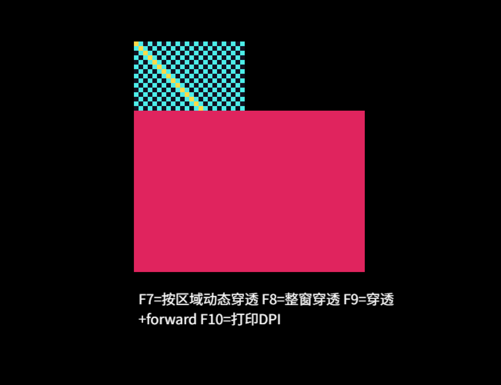
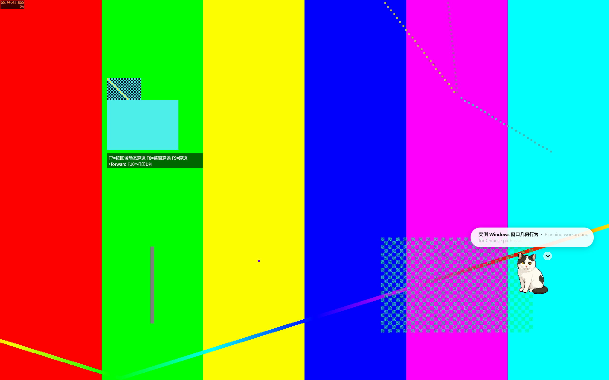
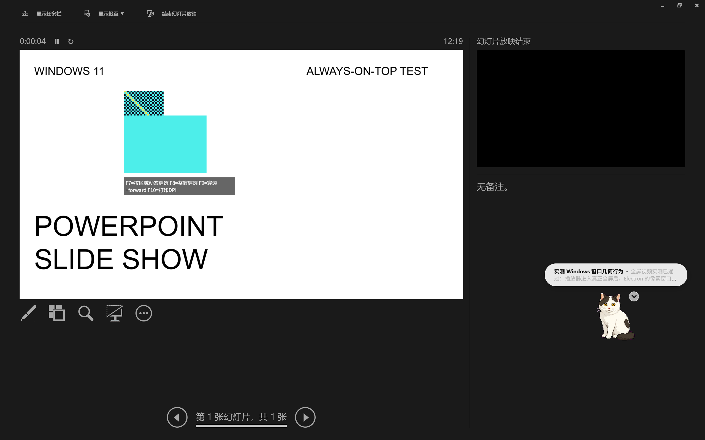
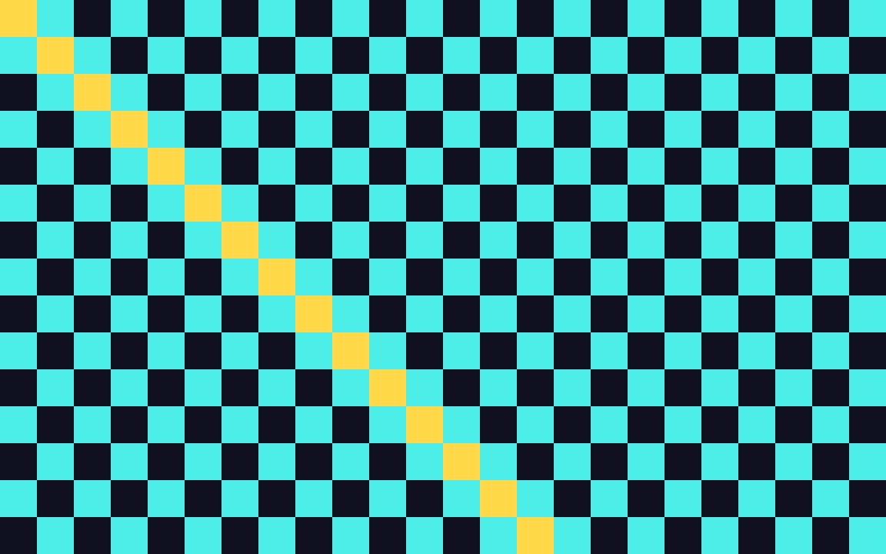
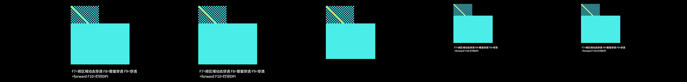

# Electron 透明窗口与跨 DPI 实测报告

测试日期：2026-07-29

## 0. 环境

- Windows 11 家庭中文版 25H2，OS Build `26200.8875`
- Node.js `v24.13.0`
- npm `11.6.2`
- Electron `v43.2.0`
- 主显示器 `DISPLAY1`：右侧，`2560×1600`，150%，Electron `scaleFactor = 1.5`
- 副显示器 `DISPLAY2`：左侧，`2560×1440`，100%，Electron `scaleFactor = 1`
- 显示器配置与上次报告相比无变化。
- 测试窗口采用题目给出的参数：`transparent:true`、`frame:false`、`alwaysOnTop:true`、`skipTaskbar:true`、`hasShadow:false`、`resizable:false`，并调用 `setAlwaysOnTop(true, "screen-saver")`。
- C3 为验证区域命中，额外加入了 F7：每 25 ms 根据鼠标位置动态切换 `setIgnoreMouseEvents`。这只是测试工具，不改变 F8/F9 的原始行为。

## 1. C1～C7 逐项

### C1. 透明区域的边缘

**结论：深色背景上没有看到白色、灰色或半透明矩形轮廓。**

窗口放在纯黑色顶层背景上后，除棋盘、色块和提示文字外，其余区域与背景连续；窗口四周和四角都没有残留亮边。Win32 测得 `GetWindowRect` 与 `DWM_EXTENDED_FRAME_BOUNDS` 相同，也没有额外的不可见外边距。

原始截图：

四倍最近邻放大：

### C2. Windows 11 圆角与阴影

**结论：没有观察到阴影；无可观察边框，无法判断系统是否对窗口外框强制圆角裁切。**

透明外框本身完全不可见，四角只是连续的纯黑背景，因此没有可供判断圆角半径的边界。可见内容色块的直角没有被系统裁圆。`hasShadow:false` 生效，窗口周围未见阴影。

### C3. 点击穿透的粒度

**结论：F8/F9 都是整窗切换；仅靠它们不能同时做到“色块可点、透明区穿透”。加入动态命中区域后可以做到。**

实际结果：

| 模式 | 点色块 | 点透明区域 | 额外现象 |
|---|---|---|---|
| 默认 | Electron 收到点击并打印“粉色方块被点到了” | Electron 窗口截获点击，下面窗口收不到 | 透明像素不等于点击穿透 |
| F8 `setIgnoreMouseEvents(true)` | 色块不再响应，点击到达下面窗口 | 点击到达下面窗口 | 整个窗口一起穿透 |
| F9 `{forward:true}` | 色块不再响应，点击到达下面窗口 | 点击到达下面窗口 | Electron 仍收到 `mousemove`，但点击不会留给 Electron |
| F7 动态区域 | 鼠标进入色块区域后关闭穿透，色块能点击 | 鼠标在透明区域时开启穿透，下面窗口收到点击 | 实测可行 |

底层点击靶窗口记录到：

- F8：色块位置和透明位置各收到一次点击。
- F9：色块位置和透明位置各收到一次点击。
- F7：只在透明位置收到点击；色块位置由 Electron 收到。

F9 下 renderer 同时记录到色块位置 `mousemove x=200 y=150` 和透明位置 `mousemove x=50 y=149`，证明 `forward` 只保留了鼠标移动转发，没有恢复区域点击。

Win32 扩展样式也随穿透切换：默认不含 `WS_EX_TRANSPARENT`；F8/F9 开启后出现 `WS_EX_TRANSPARENT` 和 `WS_EX_LAYERED`，与实际整窗穿透一致。

动态方案的测试实现是：

1. 用 `screen.getCursorScreenPoint()` 取得屏幕坐标。
2. 与 `win.getBounds()` 做坐标换算。
3. 鼠标在可交互矩形内时调用 `setIgnoreMouseEvents(false)`。
4. 鼠标在透明区域时调用 `setIgnoreMouseEvents(true, { forward:true })`。

该方案在当前静态色块上可用，但边缘快速移动时存在轮询竞争。正式产品更适合用原生 `WM_NCHITTEST`、窗口 region 或等价的原生命中测试，并让命中形状与动画帧同步。

### C4. `skipTaskbar`

**结论：任务栏、Alt+Tab、Win+Tab 都没有出现该窗口的独立入口。**

- 任务栏没有 Electron 图标。
- Alt+Tab 的应用卡片列表中没有 `Electron Pixel Probe`。
- Win+Tab 的任务视图中也没有该窗口卡片。
- 由于窗口使用 `screen-saver` 置顶层级，切出 Alt+Tab / Win+Tab 时，窗口内容本身仍可能绘制在切换界面上方；它只是不可被当作一个任务选中。

### C5. 全屏置顶行为

#### 本地播放器全屏

**结论：通过。** 使用 ffplay 进入真正全屏后，Electron 测试窗口仍在视频画面上方，没有被压到下面。

下图左上方的棋盘和青色色块是 Electron 探针：

#### PowerPoint 放映模式

**结论：部分通过。** 本机有 Microsoft PowerPoint。进入双屏放映后，Electron 放在主屏时仍覆盖在 PowerPoint 的全屏演示者视图之上。

PowerPoint 把实际幻灯片输出自动分配到了另一台显示器；尝试在放映过程中切换探针所在屏幕时，PowerPoint 的双屏窗口分配发生变化，因此“直接覆盖实际幻灯片输出画布”未形成稳定、可重复的截图。这一小项不冒充已验证。

#### 全屏游戏

**未能验证。** 本机没有可在不影响用户数据或账号状态的前提下直接启动的全屏游戏。

#### Teams / 微信 / 钉钉屏幕共享

**未能验证。** 本机没有正在进行且有接收端可确认结果的屏幕共享会话。仅打开客户端无法验证共享画面或本地全屏覆盖层的真实行为。

### C6. 跨 DPI 显示器时的像素清晰度

**结论：100% 和 150% 都锐利；150% 没有产生模糊渐变。**

F10 实测：

- 主屏：`scaleFactor = 1.5`，窗口逻辑 bounds 约 `402×302`，Win32 物理尺寸 `603×453`。
- 副屏：`scaleFactor = 1`，窗口逻辑 bounds 约 `402×302`，Win32 物理尺寸 `402×302`。

100% 屏：

- 每个 Canvas 源像素稳定占 `4×4` 个物理像素。
- 棋盘格边缘为硬切换。
- 黄色对角线是清晰的阶梯状。

150% 屏：

- 每个 Canvas 源像素稳定占 `6×6` 个物理像素，即 CSS 的 4 倍再乘 1.5。
- 原始截图裁片中只出现 `#4deeea`、`#101020`、`#ffd94a` 三种绘制颜色，没有插值产生的中间色。
- 黄色斜线保持纯色、清晰的阶梯状。

以下图片是对原始屏幕像素做 8 倍最近邻放大，没有用平滑滤镜。

150% 主屏：

100% 副屏：

### C7. 窗口跨屏拖动

**结论：跨 DPI 边界时有一次明显的尺寸跳变，并捕获到一帧过渡合成；没有持续模糊，稳定后立即恢复锐利。**

为得到可重复数据，使用 `SetWindowPos` 每 70 ms 向左移动 50 个物理像素，模拟慢速跨屏移动：

- `x = -300` 时仍为 `603×453`、144 DPI。
- 到 `x = -350` 时直接切为 `402×302`、96 DPI。
- Electron 的逻辑尺寸始终约为 `402×302`，变化的是每显示器 DPI 对应的物理尺寸。

录屏逐帧分析：

- DPI 切换前，主色块物理尺寸约 `300×216`。
- 切换后的下一稳定帧，主色块为 `200×144`。
- 中间捕获到一帧约 `252×188` 的过渡合成，随后立即稳定。
- 没有白帧、整窗消失或持续性模糊。

下面五帧从左到右展示切换前、过渡帧和切换后。第三帧可看到非最终尺寸，第四帧已完成重栅格化。

完整录屏：[C7 跨 DPI 拖动 MP4](c7-cross-dpi-drag.mp4)

录屏请求 30 fps，但双屏 `5120×1600` 捕获的实际平均帧率约 13.9 fps，因此过渡持续时间只能判断为“不超过相邻捕获帧间隔”，不能据此给出精确毫秒数。

## 2. C3 的明确回答

**需要额外技巧：可以做到“不透明区域可点、透明区域穿透”，但 `setIgnoreMouseEvents` 本身只能整窗切换；必须根据鼠标位置动态开关，或使用更稳健的原生 `WM_NCHITTEST` / region 命中方案。**

## 3. C6 的明确回答

**150% 缩放屏上的像素画是锐利的；`image-rendering: pixelated` 在本次 Chromium/Electron 实测中生效，没有出现插值模糊。**

## 4. 我的判断

**Windows 上做透明像素风桌面宠物没有发现阻断级硬障碍。**

透明边缘、阴影、任务栏隐藏、普通全屏视频置顶和跨 DPI 像素清晰度都达到预期。最大的坑不是渲染，而是交互命中：

1. Electron 的点击穿透 API 是整窗级，透明像素不会自动穿透。
2. 动态开关方案可行，但必须处理动画区域、鼠标快速移动和边缘竞争；生产实现优先考虑原生命中测试。
3. 跨 DPI 时物理窗口会从 150% 尺寸瞬间切到 100% 尺寸，用户能看到一次“跳一下”。宠物跨屏或沿窗口移动时，需要专门设计 DPI 切换策略、坐标换算和视觉缓冲。
4. `screen-saver` 层级对普通全屏播放器有效，但不能由本次结果外推到独占全屏游戏、受保护视频、UAC 安全桌面或所有会议共享链路。

对像素美术方向而言，本次最关键的好消息是：150% 缩放没有把像素画插值糊掉。

## 5. 未能验证清单

- C2：透明外框没有可观察边界，无法直接判断 Windows 11 是否对窗口外框施加强制圆角裁切。
- C5：全屏游戏。
- C5：Teams / 微信 / 钉钉真实屏幕共享。
- C5：PowerPoint 实际幻灯片输出画布上的直接覆盖；已验证全屏演示者视图。
- C8：按要求跳过。Electron 的启动路径不能替代 Tauri/WebView2 的启动白闪测试。
